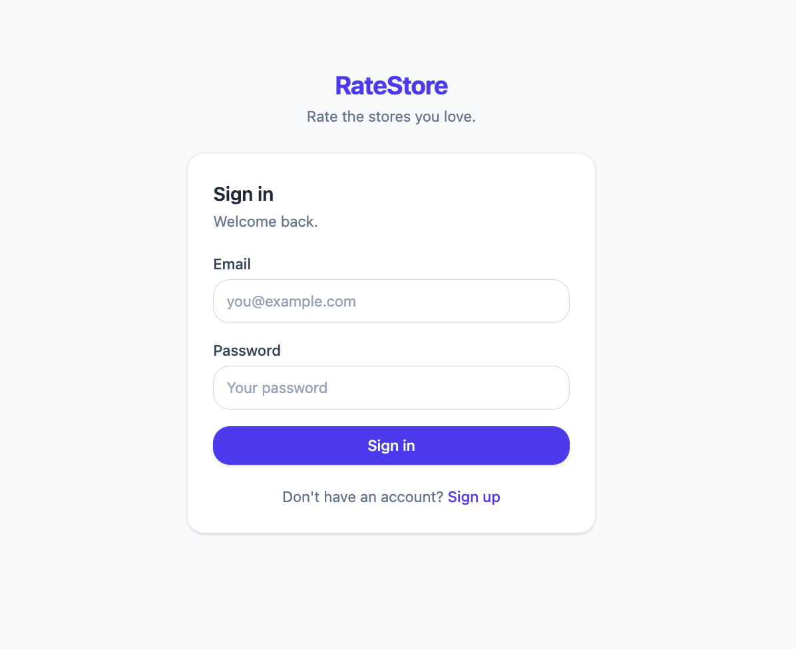
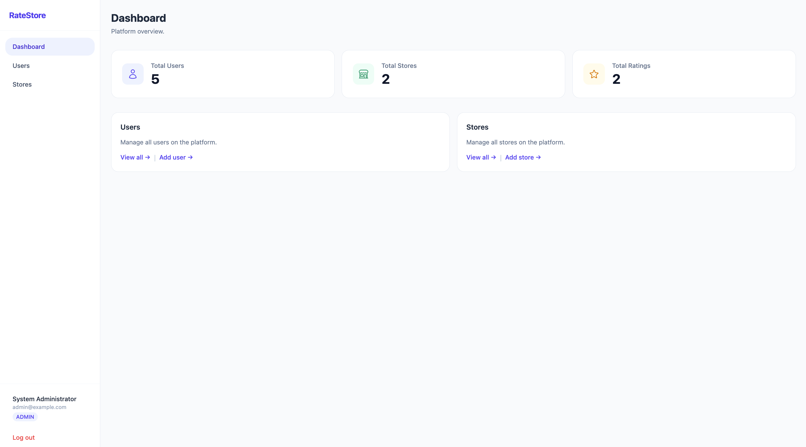
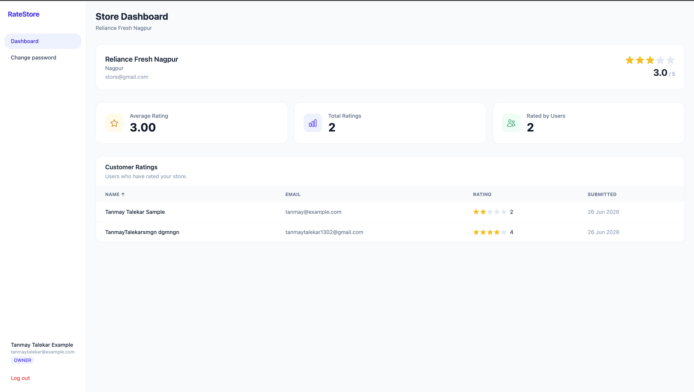

# Store Rating Platform

Store Rating Platform is a full-stack assignment project where users can sign up, browse registered stores, and submit or update one rating per store. Administrators manage users and stores, while store owners view rating activity for their own store.

## Features

- JWT-based authentication with access and refresh tokens.
- HttpOnly cookie support for session rehydration and refresh.
- Role-based access for `ADMIN`, `USER`, and `OWNER`.
- Public signup and login.
- User store browsing with search, sorting, pagination, and rating submission.
- Admin dashboard with total users, stores, and ratings.
- Admin user creation, user listing, user detail, store creation, and store listing.
- Owner dashboard showing store details, average rating, total ratings, and users who rated the store.
- Password change for authenticated users.
- PostgreSQL persistence through Prisma.
- Zod validation, centralized error handling, rate limiting, Helmet security headers, compression, and Winston logging.

## Tech Stack

### Frontend

- React `^19.2.7`
- React DOM `^19.2.7`
- Vite `^8.1.0`
- React Router DOM `^7.18.0`
- Axios `^1.18.1`
- React Hook Form `^7.80.0`
- Zod `^4.4.3`
- React Hot Toast `^2.6.0`
- React Icons `^5.6.0`
- Tailwind CSS `^4.3.1` with `@tailwindcss/vite`

### Backend

- Node.js with Express `^4.19.2`
- Prisma `^5.14.0`
- PostgreSQL
- bcrypt `^5.1.1`
- jsonwebtoken `^9.0.2`
- Zod `^3.23.8`
- Helmet, CORS, compression, cookie-parser, express-rate-limit
- Winston logging

### Database

- PostgreSQL database configured through `DATABASE_URL`.
- Prisma schema models: `User`, `Store`, and `Rating`.
- Prisma migrations are committed under `Backend/prisma/migrations`.

### Authentication

- Access tokens expire in 15 minutes.
- Refresh tokens expire in 7 days.
- Tokens are set as cookies and the access token is also returned to the SPA for in-memory use.
- Protected backend routes read `Authorization: Bearer <token>` first, then the `accessToken` cookie.

### Development Tools

- npm scripts for frontend and backend.
- ESLint for frontend linting.
- Nodemon for backend development.
- Prisma Studio for database inspection.

### Deployment

No deployment configuration is currently included in the repository.

## Project Architecture

The application is split into a Vite React SPA and an Express API.

The frontend renders role-specific routes with React Router. `AuthContext` attempts to refresh the session on app load, stores the current user in React state, and keeps the access token in memory through the Axios API module. The Axios client sends credentials for cookies and adds an `Authorization` header when an access token is available.

The backend exposes REST endpoints under `/api`. Requests pass through global middleware for security headers, CORS, request parsing, rate limiting, cookies, compression, and logging/error handling. Protected routes use JWT authentication and role authorization before controller code runs. Controllers validate request bodies with Zod, use Prisma to read or write PostgreSQL records, and return JSON responses.

Request flow:

```text
React page/component
-> Axios API client
-> Express route
-> authentication/authorization middleware
-> controller
-> Zod validation
-> Prisma Client
-> PostgreSQL
-> JSON response
```

Authentication flow:

```text
Login
-> POST /api/auth/login
-> bcrypt password check
-> accessToken + refreshToken generated
-> tokens set as HttpOnly cookies
-> accessToken returned to frontend
-> frontend stores accessToken in memory
-> future protected requests send Authorization header
-> 401 responses trigger POST /api/auth/refresh
```

## Repository Structure

```text
store-rating-platform/
|-- Backend/
|   |-- prisma/
|   |   |-- migrations/
|   |   |-- schema.prisma
|   |   `-- seed.js
|   |-- src/
|   |   |-- config/
|   |   |-- controllers/
|   |   |-- middleware/
|   |   |-- routes/
|   |   |-- utils/
|   |   |-- validators/
|   |   `-- server.js
|   |-- package.json
|   `-- prisma.config.ts
|-- Frontend/
|   |-- public/
|   |-- src/
|   |   |-- components/
|   |   |-- context/
|   |   |-- hooks/
|   |   |-- layouts/
|   |   |-- pages/
|   |   |-- routes/
|   |   |-- services/
|   |   `-- utils/
|   |-- package.json
|   `-- vite.config.js
`-- README.md
```

- `Backend/`: Express API, Prisma schema, migrations, seed script, validation, auth, and business logic.
- `Frontend/`: React SPA, layouts, pages, reusable UI components, auth context, and Axios API client.

## Prerequisites

- Git
- Node.js and npm
- PostgreSQL
- A PostgreSQL database for the application

The project does not currently specify a Node.js version in `package.json` or an `.nvmrc`.

## Complete Local Setup Guide

### Step 1 - Clone Repository

```bash
git clone <repository-url>
cd <project-folder>
```

### Step 2 - Install Dependencies

Backend:

```bash
cd Backend
npm install
```

Frontend:

```bash
cd ../Frontend
npm install
```

### Step 3 - Configure Environment Variables

Create `Backend/.env`:

```env
PORT=8000
DATABASE_URL="postgresql://<user>:<password>@localhost:5432/store_rating_db"
JWT_SECRET="replace-with-a-long-random-secret"
REFRESH_TOKEN_SECRET="replace-with-a-different-long-random-secret"
CORS_ORIGIN="http://localhost:5173"
COOKIE_SECRET="replace-with-a-cookie-secret"
NODE_ENV="development"
```

Backend variables:

- `PORT`: Express server port. The code defaults to `5000`; the existing local `.env` uses `8000`.
- `DATABASE_URL`: PostgreSQL connection string used by Prisma.
- `JWT_SECRET`: Secret for 15-minute access tokens.
- `REFRESH_TOKEN_SECRET`: Secret for 7-day refresh tokens.
- `CORS_ORIGIN`: Allowed browser origin. Defaults to `http://localhost:5173`.
- `COOKIE_SECRET`: Secret passed to `cookie-parser`.
- `NODE_ENV`: Controls secure cookie settings and Winston log level.

Create `Frontend/.env` if the backend is not running on the default API URL:

```env
VITE_API_URL="http://localhost:8000/api"
```

Frontend variables:

- `VITE_API_URL`: Axios base URL. Defaults to `http://localhost:8000/api`.

### Step 4 - Database Setup

Create a PostgreSQL database matching `DATABASE_URL`, then run migrations and seed the admin account:

```bash
cd Backend
npm run db:migrate
npm run db:seed
```

The seed script creates or preserves this admin user:

- Email: `admin@example.com`
- Password: `Admin@123`
- Role: `ADMIN`

### Step 5 - Run Backend

```bash
cd Backend
npm run dev
```

The backend listens on `PORT` from `.env`. With the documented setup, the backend URL is:

```text
http://localhost:8000
```

Health check:

```text
GET http://localhost:8000/health
```

### Step 6 - Run Frontend

```bash
cd Frontend
npm run dev
```

The Vite development server usually runs at:

```text
http://localhost:5173
```

### Step 7 - Access the Application

- Frontend URL: `http://localhost:5173`
- Backend URL: `http://localhost:8000`
- API base URL: `http://localhost:8000/api`

## Available Scripts

Backend scripts:

- `npm run dev`: Starts the Express server with Nodemon.
- `npm start`: Starts the Express server with Node.
- `npm run db:seed`: Runs `prisma/seed.js`.
- `npm run db:migrate`: Applies committed Prisma migrations with `prisma migrate deploy`.
- `npm run db:studio`: Opens Prisma Studio.

Frontend scripts:

- `npm run dev`: Starts the Vite development server.
- `npm run build`: Builds the production frontend bundle.
- `npm run lint`: Runs ESLint across the frontend.
- `npm run preview`: Serves the production build locally with Vite preview.

## Screenshots
placeholders:

- Login page

- Admin dashboard

- Owner dashboard

## Future Improvements

- Add automated tests for backend controllers and frontend user flows.
- Add update/delete backend routes or remove unused frontend API helpers for those operations.
- Move hard-coded CORS defaults into environment-only configuration.
- Add deployment documentation for the selected hosting platform.
- Add a committed `.env.example` file for each app.

## Author

Tanmay
